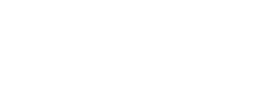

# WAC32

Le projet WAC32 (Wireless Air Control based on STM32) a été réalisé dans le cadre d'un partenariat entre l'ENSEIRB-Matmeca et STMicroelectronics.

L'objectif est de pouvoir mesurer, à l'aide d'une carte STM32WL55JC1 et de différents capteurs, la qualité de l'air dans une pièce.
Les mesures actuelles sont :
- Température (en °C)
- Humidité (en %)
- CO2 (en ppm)
- Poussière

Ces mesures sont affichées en local sur un écran LCD et envoyées via le réseau LoRaWAN.
Les utilisateur.ice.s sont ainsi alerté.e.s si un seuil critique est atteint.

## Structure

Le projet est découpé en 3 grandes structures :
- Le projet implémenté sur la carte Nucleo (dossier STM32_project)
- L'application Matlab (dossier Matlab_app)
- Les sources méca pour construire le boitier (dossier Meca)

## Utilisation

Après avoir branché, soit sur batterie, soit sur secteur, les 3 boitiers, les données liées à la qualité de l'air s'affiche sur l'écran LCD de chacun. Lorsqu'un seuil moyen est atteint (défaut : 800 ppm pour le CO2), l'écran clignote en jaune. Lorsque le seuil max (défaut : 1000 ppm), il clignote en rouge.
Ces limites peuvent être modifiés à l'aide de la liaison UART (115200 bauds 8-N-1).

Le boitier se présente sous cette forme :

La démo d'application permettant de venir récupérer les données de 3 boitiers sur le réseau LoRaWAN se présente sous cette forme :

## Auteurs

- [@George Chapman](https://www.linkedin.com/in/g-bchapman/)
- [@Nicolas Castagnet](https://www.linkedin.com/in/nicolascastagnet/)
- [@Maël Deval](https://www.linkedin.com/in/ma%C3%ABl-deval-73bab1172/)
- [@Jérémy Domingos](https://www.linkedin.com/in/jeremy-domingos/)
  
  
  [](https://enseirb-matmeca.bo