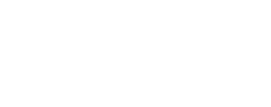

# WAC32

Le projet WAC32 (Wireless Air Control based on STM32) a été réalisé dans le cadre d'un partenariat entre l'ENSEIRB-Matmeca et STMicroelectronics.

L'objectif est de pouvoir mesurer, à l'aide d'une carte STM32WL55JC1 et de différents capteurs, la qualité de l'air dans une pièce.
Les mesures actuelles sont :
- Température (en °C)
- Humidité (en %)
- CO2 (en ppm)
- Poussière

Ces mesures sont affichées en local sur un écran LCD et envoyées via le réseau LoRaWAN.
Les utilisateur.ice.s sont ainsi alerté.e.s si un seuil critique est atteint.

## Auteurs

- [@George Chapman](https://www.linkedin.com/in/g-bchapman/)
- [@Nicolas Castagnet](https://www.linkedin.com/in/nicolascastagnet/)
- [@Maël Deval](https://www.linkedin.com/in/ma%C3%ABl-deval-73bab1172/)
- [@Jérémy Domingos](https://www.linkedin.com/in/jeremy-domingos/)